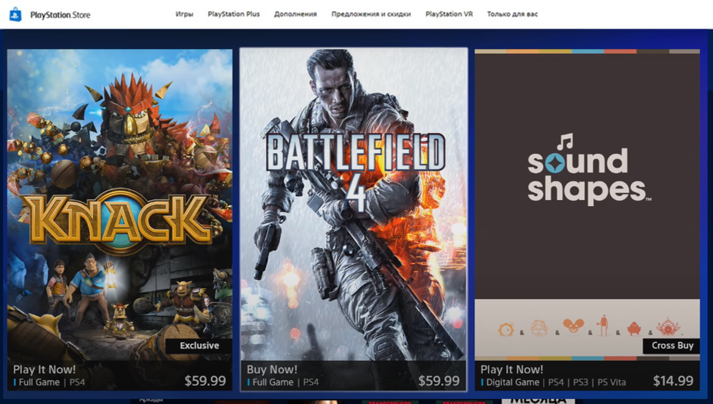

# Lab DIO - Criar Clone da PSN Store com Angular
Lab da DIO para o bootcamp Santander Fullstack Java + Angular com o desafio de criar um clone da PSN Store usando Angular.



<p align="middle">+</p>


## Inspirações
Resolvi misturar a tela enviada na descrição do desafio com o layout atual da [PlayStation Store](https://www.playstation.com/pt-br/).

## Links
- [Página Oficial da PlayStation Store](https://www.playstation.com/pt-br/)
- [Figma](https://www.figma.com/file/uYnQgr0HxR25ku60ehP5Fn/PSN-Store-Clone?type=design&node-id=1%3A16&mode=design&t=8UnKwfRIHhoDutl4-1).

## Para rodar o projeto
- Garanta que você tem o ```node``` e o ```git``` instalado em sua máquina;
- Faça o clone do projeto com ```git clone https://github.com/Enyus/dio-angular-blog.git```;
- Entre na pasta DIO_Angular_Blog com ```cd .\DIO_Angular_Blog\``` e instale as dependências com ```npm install```;
- Se não tiver o Angular CLI instalado na sua máquina, instale-o globalmente com o código ```npm install -g @angular/cli```
- Rode a aplicação com ```ng serve```. O app será executado na porta http://localhost:4200/.